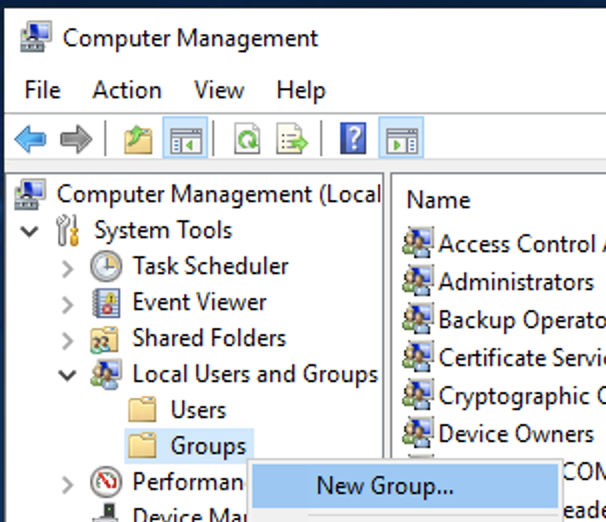

# The `mqbrkrs` group

ACE relies on an operating system level user group called `mqbrkrs` to designate that a given local user should be treated as an ACE administrator. You should create this group and add your user account to it before continuing.

* [Linux](#linux)
* [macOS](#macos)
* [Windows](#windows)

Pull requests to this documentation is welcome for more esoteric platforms such as AIX!

## Linux

To create the `mqbrkrs` group and add yourself to it on Linux run the following commands:

```sh
$ groupadd mqbrkrs
$ usermod -aG mqbrkrs `whoami`
```

You generally need to log out and in again for changes in group membership take effect.

## macOS

To create the `mqbrkrs` group:

1. Open the _System Preferences_ and select _Users & Groups_
   
1. Unlock the panel by clicking the padlock icon in the lower left and entering your password
    
1. Click the small plus icon at the bottom of the user list on the left
    
1. Select "Group" from the dropdown and enter the name `mqbrkrs` and click _Create Group_
    
1.  Expand the _Groups_ section in the left hand list and select `mqbrkrs`. Check the box next to your name to add yourself to the group.
    
1. Log out and back in again to update your group membership

## Windows

To create the `mqbrkrs` group:

1. As an administrator, open the _Computer Management_ program from the _Administrative Tools_ section of the _Control Panel_
    
1. Right click on the _Groups_ folder under _Computer Management > System Tools > Local Users and Groups_ and select _New Group..._
    
1. Give the group the name `mqbrkrs`, the description `IBM App Connect Enterprise Administration Group`, and add your user as a member, before clicking _Create_.
    
1. Log out and in again to refresh your group memberships
    