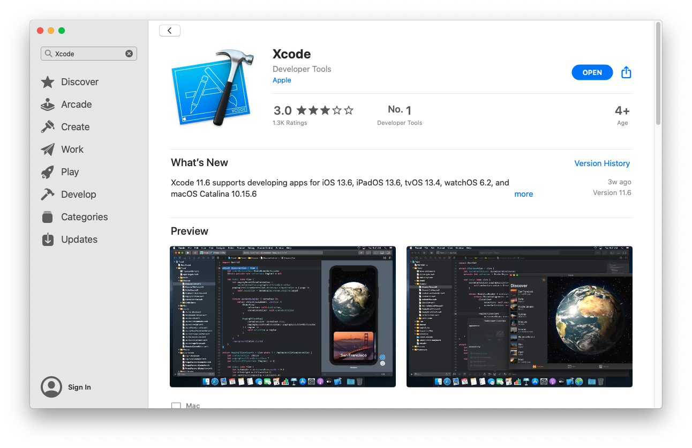

# macOS

IIB v10 and ACE v11 both have unofficial support for macOS. At v10 this is entirely internal only and is not released to customers, whereas at v11 we release an unsupported developer edition. There is no officially supported release on macOS.

At the time of writing there is no support for running IIB or ACE on the upcoming ARM-based macOS releases. This may change in the future but I do not imagine it happening any time soon.

You should be able to use any recent macOS release that is still in support, but in general most people just use whatever the latest release is, i.e. macOS 10.15 (Catalina) at the time of writing.

* [Java development kit](#java-development-kit)
* [Apple Xcode](#apple-xcode)
* [Homebrew tools](#homebrew-tools)

## Java development kit

A large chunk of IIB/ACE is written in Java, as such you will need a Java development kit of an appropriate version. Since the server bundles an IBM JRE we make use of a number of IBM specific extensions, so an IBM JDK is required to build the product.

Both IIB and ACE required Java 8. IIB fix packs before 10.0.0.15 can be built with Java 7 but I would not recommend this for the purposes of a localbuild.

Go to the [IBM SDKs for Java download page on JIM](http://w3.hursley.ibm.com/java/jim/) to get the latest Java 8 release that is available for _Mac OSX / AMD64/EM64T_. Note that this may not be the most recent release in the list as macOS JDKs from IBM come out less frequently than other platforms. Select either the `.tar.Z` SDK or the `.tar.gz` SDK.

Once you have downloaded the JDK, extract it to a known place on your disk, I prefer `/opt/ibm/java/8.0.x.y/`. The path you extract the JDK to is known as your `JAVA_HOME` and you will need to know this location later on so make a note of it now.

The JVMs provided by IBM aren't directly suitable for use as your system JVM due to extra requirements imposed by macOS. If you really want to use this as your system JVM rather than installing one through other means I have written this [`install_jvm.sh`](install_jvm.sh) script which will attempt to perform the necessary fixups for you.

## Apple Xcode

Apple Xcode is the official compiler toolchain for macOS and is required to build and run on macOS. Xcode is only available from the Apple App Store, you will need to create an Apple ID if you have not already created one.

Open the `App Store` application from Spotlight or the _Applications_ folder and search for _Xcode_.



This install can take a while, and it must complete before you move on to the next section.

Once Xcode has installed, open a terminal and run the following command
```bash
$ xcode-select --install
```
to make the Xcode command line utilities available. Restart your terminal and you should have access to `clang++`, the C++ compiler:
```bash
$ clang++ --version
Apple clang version 11.0.3 (clang-1103.0.32.62)
Target: x86_64-apple-darwin19.6.0
Thread model: posix
InstalledDir: /Applications/Xcode.app/Contents/Developer/Toolchains/XcodeDefault.xctoolchain/usr/bin
```

It is important to note that IIB/ACE cannot be built as an _Xcode_ project, we use our own build system. The Xcode tools are merely needed to build the product. 

## Homebrew tools

**NB**: You must have fully installed Xcode before continuing onto this section.

Homebrew is the "missing package manager" for macOS and provides an easy command line interface for installing 3rd party packages. We need the GNU version of the `tar` command, and Python 3. Both of these can be installed without Homebrew but it's much more tedious.

To install Homebrew visit the [Homebrew website](https://brew.sh/) and follow the one line installation instruction. Once complete install GNU Tar and Python 3:
```bash
$ brew install gnu-tar python
```

Once complete you should have `python3` and `gtar` available on your PATH:
```
$ python3 --version
Python 3.7.7
$ gtar --version
tar (GNU tar) 1.32
Copyright (C) 2019 Free Software Foundation, Inc.
License GPLv3+: GNU GPL version 3 or later <https://gnu.org/licenses/gpl.html>.
This is free software: you are free to change and redistribute it.
There is NO WARRANTY, to the extent permitted by law.

Written by John Gilmore and Jay Fenlason.
```