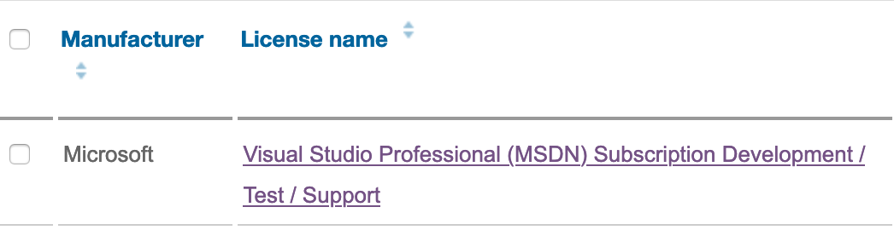
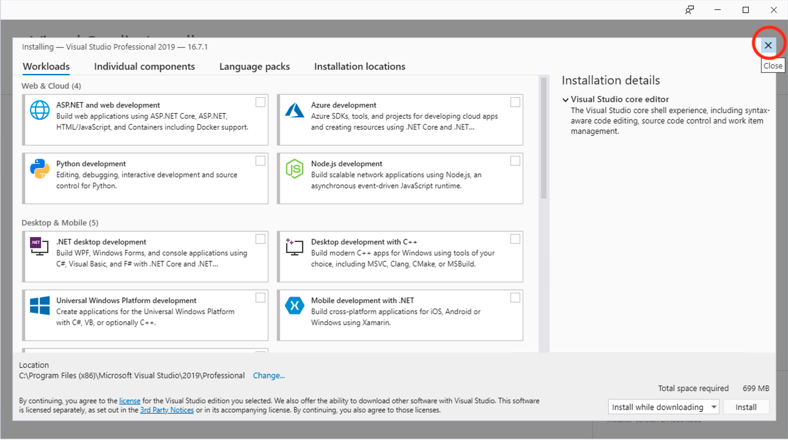
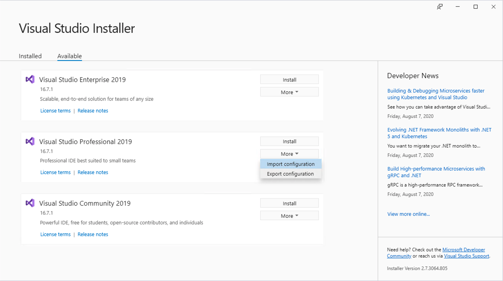

# Windows

You should be able to build IIBv10/ACEv11 on any fairly modern Windows release. I personally would recommend Windows 10 or Windows Server 2019 just because they are the latest.

We no longer support 32 bit Windows builds, and have never supported Windows on ARM. If you want to try building Windows on ARM and have the resources, please be my guest.

* [Java development kit](#java-development-kit)
* [Microsoft Visual Studio](#microsoft-visual-studio)
* [Perl 5](#perl-5)
* [Python 3](#python-3)
* [IBM MQ](#ibm-mq)

## Java development kit

A large chunk of IIB/ACE is written in Java, as such you will need a Java development kit of an appropriate version. Since the server bundles an IBM JRE we make use of a number of IBM specific extensions, so an IBM JDK is required to build the product.

Both IIB and ACE required Java 8. IIB fix packs before 10.0.0.15 can be built with Java 7 but I would not recommend this for the purposes of a localbuild.

Go to the [IBM SDKs for Java download page on JIM](http://w3.hursley.ibm.com/java/jim/) to get the latest Java 8 release. For Windows you need to ensure you choose the _Windows / AMD64/EM64T_ release and either the _SDK Package (InstallShield)_ if you want to use this release as your system JDK/JRE, or _SDK Package (zip)_ if you want to manually manage your JREs.

The location where you install the JDK is called your `JAVA_HOME`, and will be required when setting up your localbuild later. Make a note of this location now. If you use the InstallShield package this will default to `C:\Program Files\IBM\Java80`.

## Microsoft Visual Studio

Microsoft Visual Studio is the official compiler toolchain for Windows. Although IIB/ACE cannot be built as Visual Studio projcets, we rely on the various tools and libraries that come with Visual Studio.

Before you can download Visual Studio you must first have a _Visual Studio Professional (MSDN)_ subscription. Visit the [Software License Management](https://slm.w3ibm.mybluemix.net/SLM/Home) site to request this license if you do not already have it. You need it for _Development/Test/Support_ usage. This will have to be approved by your manager and procurement. Once approved you should receive a welcome email from Microsoft to your w3 email. The license should appear in the SLM list like this once active:



Once you have received your license, go to the [My Visual Studio](https://my.visualstudio.com/) site and sign in with your w3ID. Once logged in, go to the _Downloads_ page.

The version of Visual Studio you need depends on what IIB/ACE version and fix pack you want to build. You need to install different Visual Studio versions depending on what versions you want to build. Currently the requirements are:

Visual Studio Version | IIB/ACE Release 
---|---
Visual Studio 2013 Professional | IIB 10.0.0.21 and below
Visual Studio 2017 Professional | ACE 11.0.0.11 and below
Visual Studio 2019 Professional | IIB 10.0.0.22 and above, ACE 11.0.0.12 and above, ACE 12.0.1.0 and above

It should be possible to build ACE v11 and v12 with Visual Studio 2022, but this is not officially supported at this time.

When installing Visual Studio you will be asked to choose from a daunting list of options. Generally speaking you need the .NET Development tools, Desktop C++ tools, and Windows SDKs. I have prepared `.vsconfig` files that can be imported into the Visual Studio installer for Visual Studio 2017 and Visual Studio 2019 which should reproduce the selections that I use:

* [`vs2017.vsconfig`](vs2017.vsconfig)
* [`vs2019.vsconfig`](vs2019.vsconfig)

To use these files in the _Visual Studio Installer_, first click the small close button to exit back to the main screen of the installer:



Then choose _More -> Import configuration_ from the _Visual Studio 2017 Professional_ or _Visual Studio 2019 Professional_ tile as appropriate:



Select your downloaded copy of the `.vsconfig` files above, leave the default install path unchanged, and then click _Install_

## Perl 5

We use Perl in a small number of places in the build, and it is heavily used by the test material. You need a Perl 5 distribution, I recommend [Strawberry Perl](http://www.strawberryperl.com) but other distributions are available.

You will need to know the path to your `perl.exe` executable later on when setting your `PERL_HOME`. The `PERL_HOME` is the folder that contains the bin folder where `perl.exe` residse. For example if you install Strawberry Perl in the default location then `perl.exe` is located at `C:\Strawberry\perl\bin\perl.exe` and so `PERL_HOME` will be `C:\Strawberry\Perl`.

You can double check what version you have installed by running `perl --version`, for example:
```
C:\Users\gb120268.GB120268-WINDOW>C:\Strawberry\perl\bin\perl --version

This is perl 5, version 28, subversion 1 (v5.28.1) built for MSWin32-x64-multi-thread

Copyright 1987-2018, Larry Wall

Perl may be copied only under the terms of either the Artistic License or the
GNU General Public License, which may be found in the Perl 5 source kit.

Complete documentation for Perl, including FAQ lists, should be found on
this system using "man perl" or "perldoc perl".  If you have access to the
Internet, point your browser at http://www.perl.org/, the Perl Home Page.
```

## Python 3

Some newer parts of the build, and the ACE v11 SIS test framework, are written in Python 3. The minimum required version is Python 3.4, but the newest version of Python 3 should work. Python 2 is _not_ supported.

You need the `python3` executable to be on your PATH. Get the latest release of Python 3 for _Windows x86_64_ from the [Python downloads site](https://www.python.org/downloads/windows/).

Make sure you install Python for all users and add it to your PATH when asked during installation. Once it is installed you should be able to open a new command prompt and check its version by running `python3 --version`:

```
C:\Users\gb120268.GB120268-WINDOW>python3 --version
Python 3.7.4
```

If the Microsoft Store opens up when you try to run `python3` this likely means you have the Windows 10 _App execution alias_ enabled for Python. Open up the Windows Settings app, go to _Apps -> Managed app execution aliases_, and disable the execution aliases for `python` and `python3`.

## IBM MQ

Although IIB v10 and above no longer require a queue manager, we still rely on the header files provided by MQ to be available during the build.

IBM MQ can be downloaded internally from the [IBM Internal DSW Downloads (Extreme Leverage)](https://w3-03.ibm.com/software/xl/download/ticket.do) page. Search for `IBM MQ 9` and download the most recent release for _Windows 64-bit_. At the time of writing this is

* IBM MQ V9.2 Long Term Support Release for Windows 64-bit Multilingual (CC5TWML).

Once it has downloaded, extract and run the installer. I would recommend installing the full MQ server, rather than just the MQ client as it will make local testing much easier.