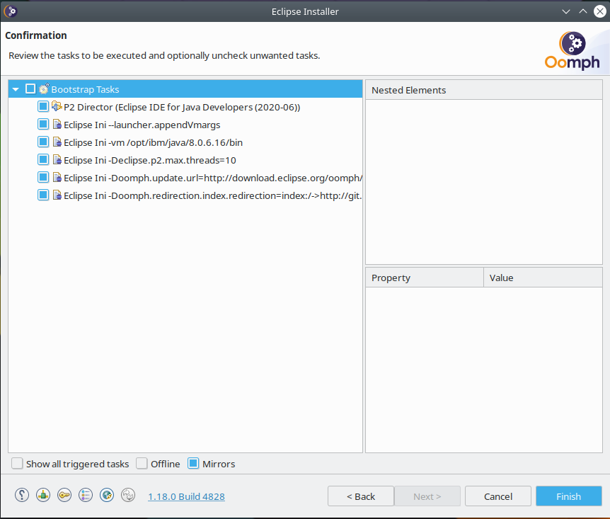

# Installing Eclipse and the RTC client

The RTC client is an Eclipse plugin, so you will need a copy of Eclipse to install this into. Since the ACE toolkit is an Eclipse application, you can install it directly into there. I prefer to install it into a clean Eclipse instance. The RTC plugin is only compatible with Eclipse 2020-06 and older, these instructions will guide you through installing this back level version of Eclipse.

Before continuing make sure you have installed an IBM Java 8 SDK as described in the [Prerequisite software](../prereqs/index.md) section for your platform.

## Installing Eclipse 2020-06

1. Go to the [Eclipse Installer Download page](https://www.eclipse.org/downloads/packages/installer) to download and then run the Eclipse Installer.
1. Click the _hamburger_ menu icon in the top right of the Eclipse Installer to open up the side menu
   
1. From the side menu, click _Advanced Mode..._ to bring up the Advanced Mode window. Select _Eclipse IDE for Java Developers_ and change the _Product Version_ to `2020-06`.
   
1. Click the _Manage virtual machines..._ icon next to the _Java 1.8+ VM_ drop down box, circled in the above image. Click the _Browse_ button and navigate to your IBM Java 8 SDK installation. The folder you choose should contain the `bin` and `jre` folders which make up your Java SDK.
   
1. Once loaded, choose the JDK variant of your Java installation and click OK.
   
1. Click next twice and then configure where you wish Eclipse to be installed, then click Next and then Finish.
   
1. When prompted, accept the licenses and the unsigned content. Eclipse should launch automatically once completed. Choose any path as your workspace, though I personally choose `~/eclipse/workspace`.
   
## Installing the RTC 6.0.6 Eclipse plugin

1. Go to the [RTC 6.0.6 downloads page](https://jazz.net/downloads/rational-team-concert/releases/6.0.6?p=allDownloads) and download the _p2 Install Repository_. Save this archive to your Eclipse workspace folder.
1. Install the RTC Eclipse plugin by choosing _Help -> Install New Software..._ from the menu bar.
   
1. In the _Install_ dialog click the  _Add_ button, then click _Archive_. Select the p2 archive you just downloaded which you should have saved to your Eclipse workspace folder and click _Add_.
   
1. Select the _Rational Team Concert Client_ plugin from the list then click through the remaining dialogs to install the plugin.
    
1. Approve the installation of the unsigned plugin, and then restart RTC when prompted.
