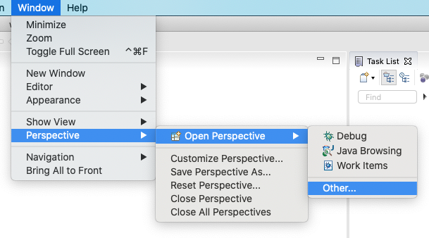
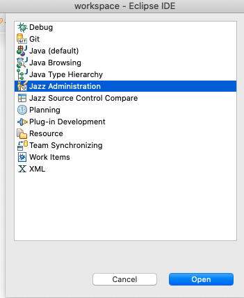
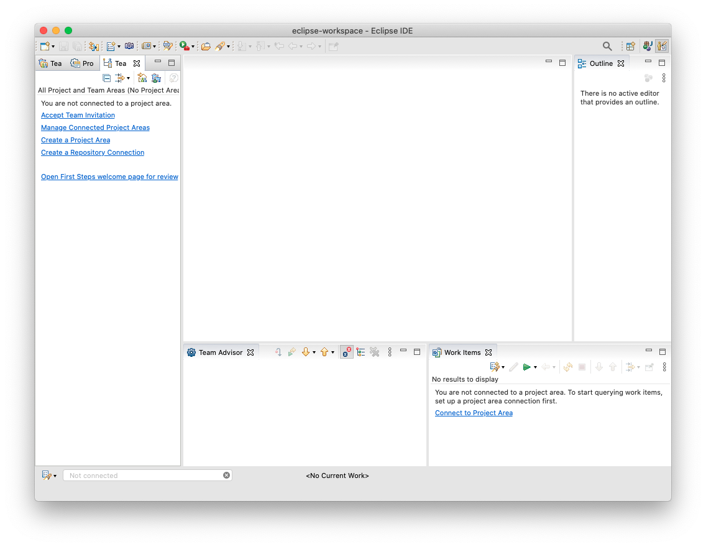
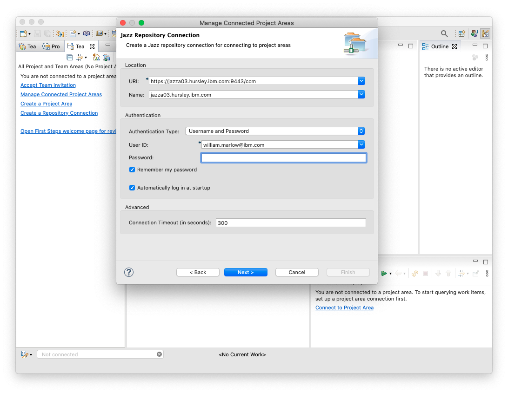
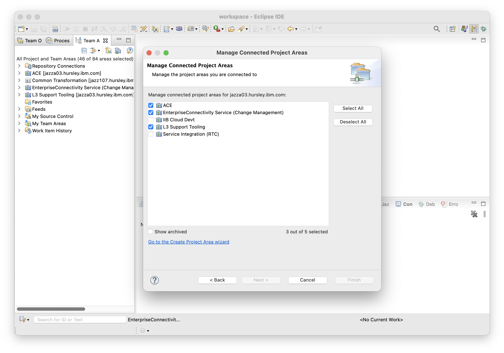

# Connecting to Jazza03

Now that you have Eclipse with the RTC client installed, you need a _repository connection_ to the IIB/ACE RTC server.

1. If you haven't already done so, request access to the RTC server Jazza03 via the [Hursley ITIM](https://huritim.hursley.ibm.com/itim/self/Login/Logon.do). The account type you need is `Hurjazza03Users`. This can take some time to come through.
2. In Eclipse, switch to the _Jazz Administration_ perspective. Select _Window -> Perspective -> Other Perspective_ and then _Jazz Administration_ from the list of available options
    
    
3. Switch the left hand panel to show the _Team Artifacts_ tab
    
4. Click _Manage Connected Project Areas_, then click _Next_ on the first page of the wizard to start creating a new repository connection.
5. Specify `https://jazza03.hursley.ibm.com:9443/ccm` for the URI and use your w3ID username and password as your authentication details and click _Next_:
    
6. Select the project areas that are relevant to you:
   * `ACE` contains the ACE v12/vNext development streams and is owned by the Ghia team. Contact the [Ghia team lead](https://w3.ibm.com/bluepages/profile.html?uid=000399866) for access.
   * `EnterpriseConnectivity Service (Change Management)` contains the streams for ACE v11 and earlier and is owned by the ACE L3 team. Contact the [ACE L3 team lead](https://w3.ibm.com/bluepages/profile.html?uid=074972866) for access.
   * `L3 Support Tooling` contains tooling used by the ACE L3 team, such as SBARTA/FixPackager and some project management tools. Contact the [ACE L3 team lead](https://w3.ibm.com/bluepages/profile.html?uid=074972866) for access.
   * The `Service Integration (RTC)` and `IIB Cloud Devt` project areas are no longer used.
    
    If a project area you need does not appear in your list, then you need to seek access permission from the relevant owner.
7. Click _Finish_.

## CRJAZ6022E Errors

If you encounter a CRJAZ6022E error saying

```
Remote host closed connection during handshake.
SSL peer shut down incorrectly
```

then you need to edit the `eclipse.ini` file for your Eclipse installation and add the following line:

```
-Dcom.ibm.team.repository.transport.client.protocol=TLSv1.2
```

to enable TLSv1.2 in RTC. You need to restart Eclipse after changing the `eclipse.ini` file before trying again.

## Connecting to Jazz107 (optional)

The GDM and DFDL source code is stored in a separate RTC repository. The steps to connect to this repository are the same as those shown above with the following changes:

* The Hursley ITIM account type you need is `Hurjazz107Users`.
* The repository URI is `https://jazz107.hursley.ibm.com:9443/jazz`
* The RTC project area you need is _Common Transformation_.
* The _Andros_ stream contains the head of stream development codebase for DFDL.