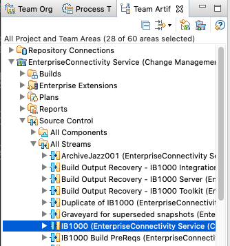
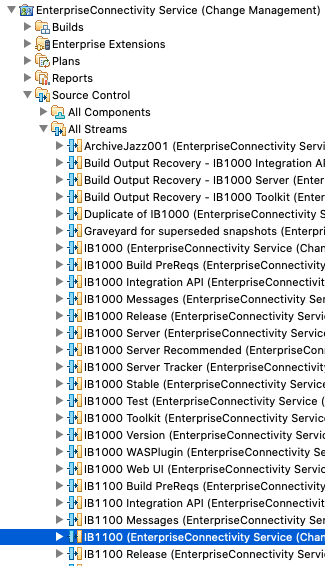
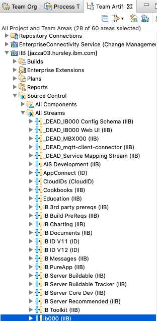
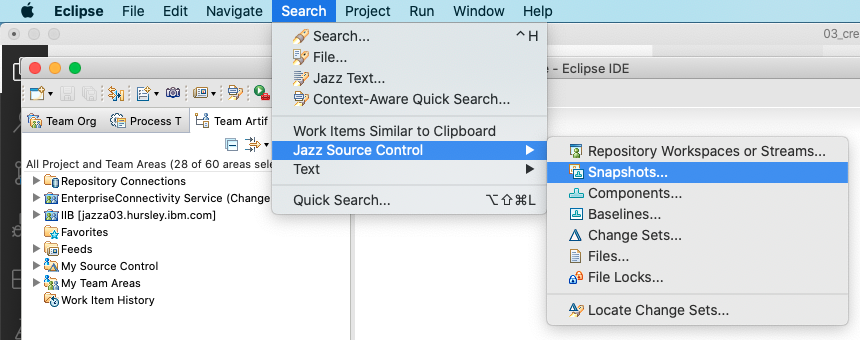
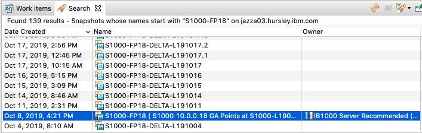
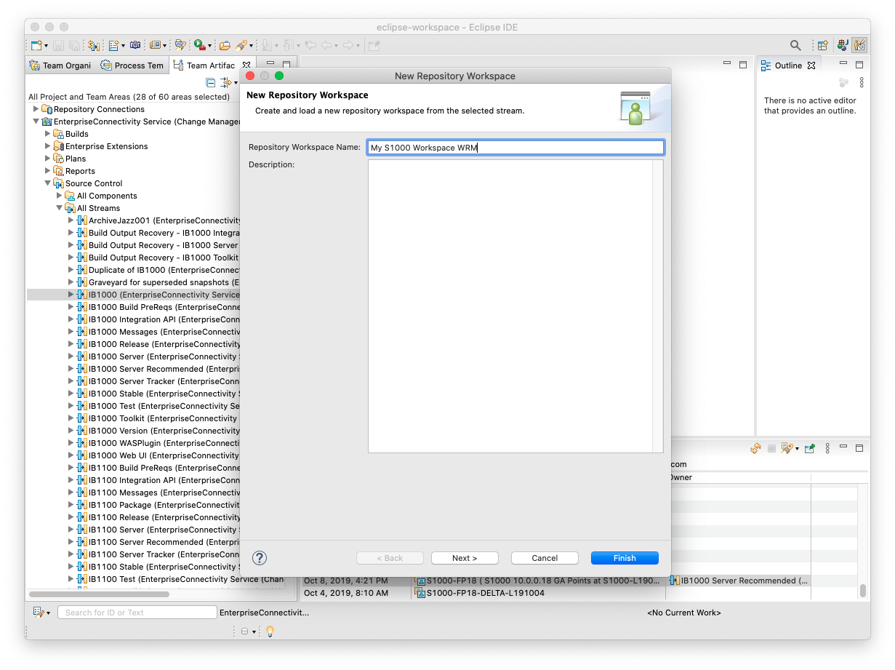
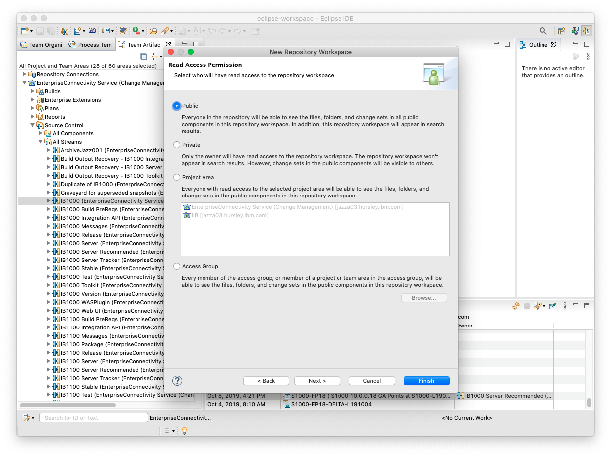

# Creating your RTC workspace

The RTC workspace contains all the code you need to build the IIB/ACE server runtime. The steps you need to take to create your workspace depend on which version you are trying to build.

1. Find the appropriate stream or snapshot for the version you wish to build:
    * **IIB v10**: Find the `IB1000` stream underneath _EnterpriseConnectivity Service (Change Management) in the _Team Artifacts_ panel:

        

    * **ACE v11**: Find the `IB1100` stream underneath _EnterpriseConnectivity Service (Change Management)_ in the _Team Artifacts_ panel:

        

    * **ACE vNext**: Find the `ib000` stream underneath _ACE_ in the _Team Artifacts_ panel:

        

    * **A snapshot**: If you want to build a specific snapshot (i.e. a GAd release), search for the snapshot by name by choosing _Search -> Jazz Source Control -> Snapshot_ from the menu bar. Enter the name of the snapshot you wish to build and find the original snapshot in the search results:

        
        

2. Right click the stream or snapshot and choose _New -> Repository Workspace_. Enter a unique name for your workspace (preferably one that includes your name or initials) and click _Next_. **DO NOT CLICK FINISH JUST YET**.

    

3. Click _Next_ to select the current repository as the location to store the workspace.
4. Change the read access permissions from _Private_ to _Public_. This is essential if you ever want to submit a build to the build automation using your workspace!

    

5. Click _Finish_.
