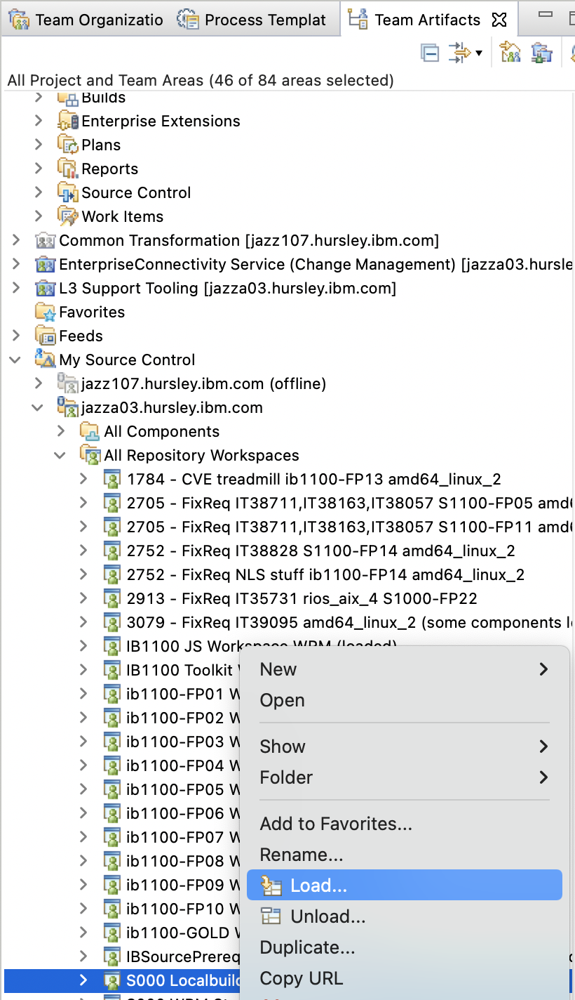
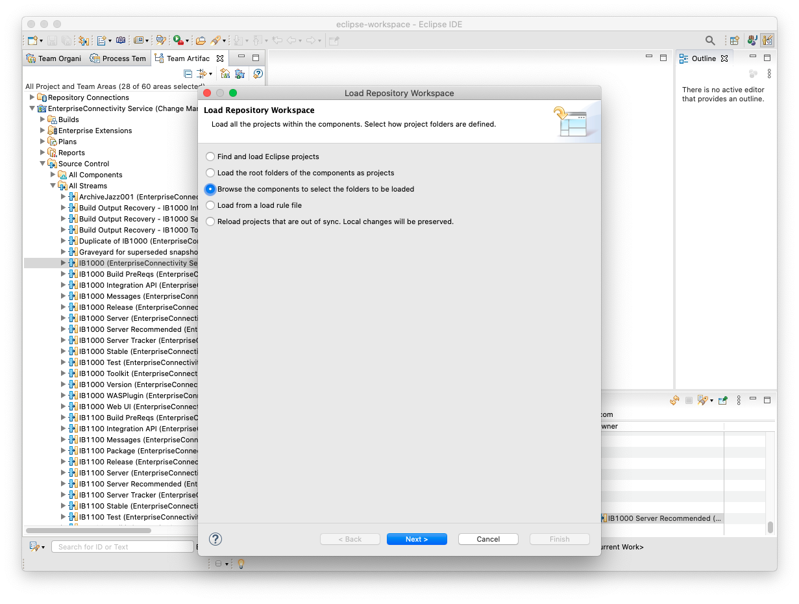
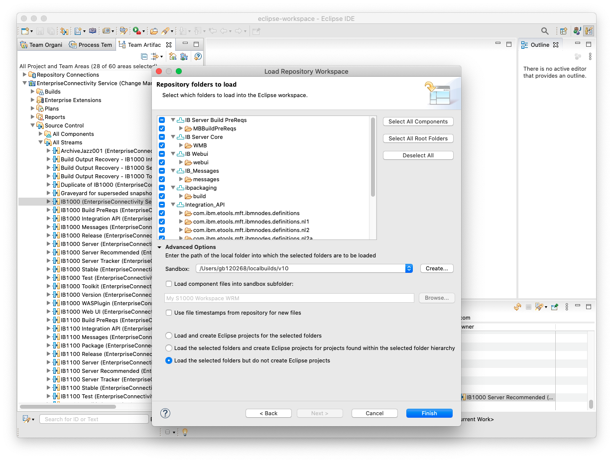
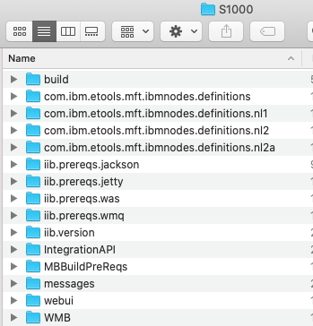

# Loading your RTC workspace

Once you have finished creating your workspace the _Load Repository Workspace_ wizard should launch automatically.

    
Manually loading your workspace 

If the _Load Repository Workspace_ wizard does not appear automatically, find your workspace in the _Team Artifacts_ panel under _My Source Control -> All Repository Workspaces_. Right click on your workspace and click _Load..._ to open the wizard.

1. Select _Browse the components to select the folders to be loaded_ and click _Next_.
    
2. Click _Deselct All_ and then _Select All Root Folders_. This should put a check mark against every folder in the list, but not against each Tetris block. This step is necessary to ensure the files are loaded onto disk with the correct layout. Expand the _Advanced Options_ and create a new _Sandbox_, this is the folder that your localbuild will be in. 

    **NB**: On Windows you _must_ choose a Sandbox path that is as short as possible. I **strongly** recommend a path such as `C:\S1000`, or else you will run into issues with the Windows max path length.
    
    If you do not want to use Eclipse as your IDE (which is my personal preference) select _Load the selected folders but do not create Eclipse projects_ before clicking _Finish_.

    
3. Click _Finish_ and wait for your workspace to load. This can take some time dependening on how fast your connection is to the RTC server. Check the _Progress_ tab to see how the loading is progressing. Once loaded the _Progress_ tab will be empty and the Sandbox folder you selected should look something like this in the _Pending Changes_ tab:

    

## ⚠️ Warning for Windows Users ⚠️

ACE v11 and v12 workspaces contain symbolic links. If you are loading such a workspace on Windows you will receive a warning that the symbolic links could not be created unless you are running as an administrator. It is generally safe to ignore this warning, but you should consider running Eclispe as an Administrator.